# Practica - Comunicación entre procesos

## Parte 2 — Implementación Práctica
Objetivo: Implementar soluciones funcionales usando mecanismos de comunicación estudiados, aplicando criterio propio sobre el diseño y demostrando apropiación real del código producido.

### Actividad 2.1 — Sockets TCP: Chat bidireccional con registro
**Capturas requeridas:**
* Captura 1: Dos terminales de clientes enviando mensajes simultáneamente.  
  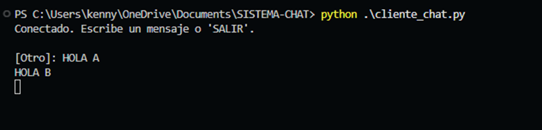 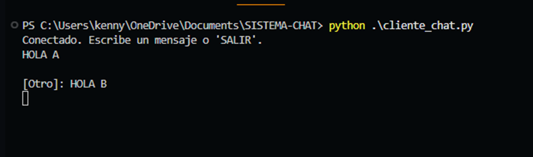
* Captura 2: Salida del servidor mostrando el registro con timestamps.  
  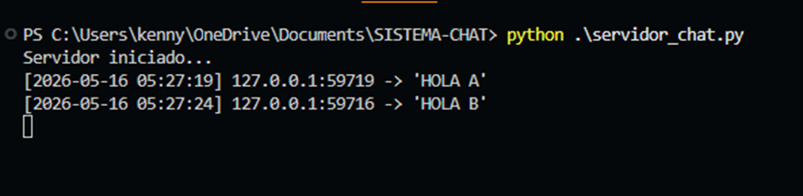
* Captura 3: Un cliente enviando SALIR y el servidor respondiendo sin errores.  
  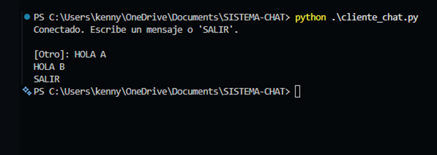
  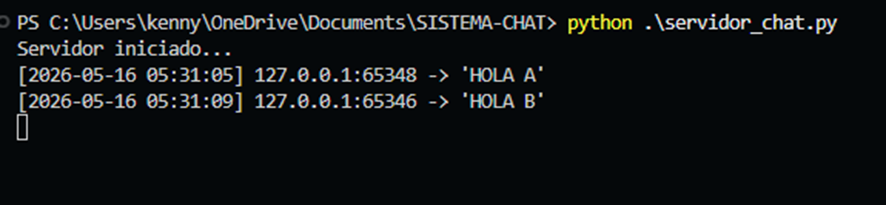

**Declaración de uso de IA:**
* **Qué consulté:** Consulté cómo solucionar dos errores específicos de Python. El primero fue un `IndexError: tuple index out of range` en el servidor al momento de imprimir la información de conexión del cliente. El segundo fue un error en el cliente al cerrar la aplicación (`Fatal Python error: _enter_buffered_busy: could not acquire lock for <_io.BufferedWriter>`), el cual era causado por la terminación abrupta del programa mientras un hilo secundario estaba a la espera.
* **Qué generó la IA:** La IA proporcionó la corrección para acceder correctamente a los índices de la tupla de conexión (reemplazando `addr[3]` por `addr[1]` para obtener el puerto). Para el cliente, la IA generó una reestructuración de la función `recibir()`, separando la lectura del socket de la función `print()` y agregando una validación (`if not data: break`) para manejar un cierre limpio sin causar colisiones en el flujo de salida estándar (stdout).
* **Qué modifiqué:** Integré los fragmentos de código corregidos por la IA en mis archivos originales (`servidor_chat.py` y `cliente_chat.py`).

**Explicación técnica del manejo de múltiples clientes en tu implementación:**
1. **Conexiones:** El hilo principal del servidor espera conexiones indefinidamente con `accept()`.
2. **Multihilo (Threads):** Por cada cliente conectado, el servidor crea un hilo independiente usando la librería `threading`. Esto evita que el servidor se bloquee esperando a un solo cliente.
3. **Difusión de mensajes:** El servidor guarda los sockets en una lista global (`clientes`). Cuando el hilo de un cliente lee un mensaje nuevo, recorre esta lista y se lo envía al resto.
4. **Clientes no bloqueantes:** Cada cliente tiene un hilo secundario en segundo plano dedicado solo a escuchar mensajes nuevos, mientras el hilo principal queda libre para leer lo que el usuario escribe en consola.

### Actividad 2.2 — RPC con control de errores
**Capturas requeridas:**
* Captura 1: Inicio del servidor y receptor de las respuestas del Cliente como un HTTP 200 (Ok). 
 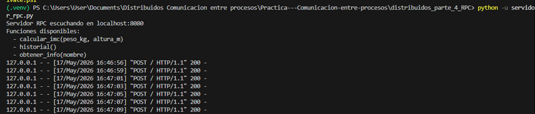
* Captura 2: Se ejecuto el cliente para que haga las conexiones y que pase los datos y ejecute la función y devuelva un resultado.  
 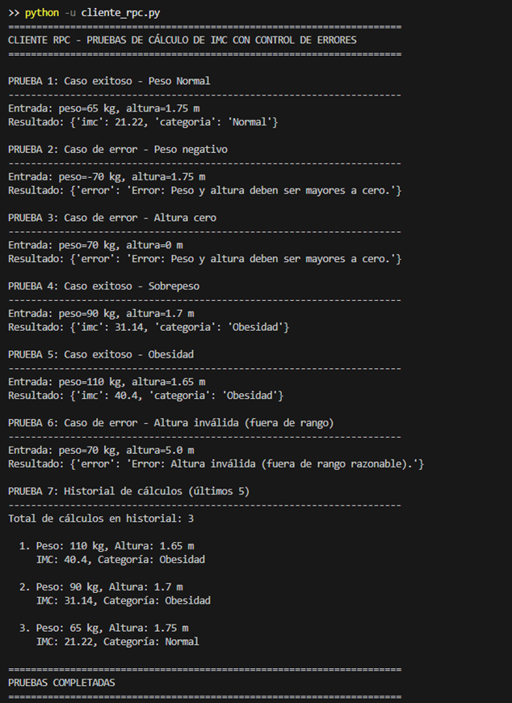 

**Declaración de uso de IA:**
* **Qué consultaste:** estructura de servidor XML-RPC, manejo de errores, historial en memoria, validación y cliente de pruebas.
* **Qué generó la IA:** servidor, `calcular_imc()`, `validar_entrada()`, `historial()`, y cliente con 7 pruebas.
* **Qué modificaste:** validaciones extra, formato de errores, historial en orden inverso, y salida del cliente.
* **Instrucciones y aprendizajes:** cómo ejecutar, uso de XML-RPC, importancia de validar y manejar errores, y que el historial se guarda en memoria.

**Explicación técnica del manejo de múltiples clientes:**
* **Modelo actual (secuencial):** El servidor se crea con `SimpleXMLRPCServer` sin mixins de concurrencia, así que atiende una petición a la vez en el hilo principal. Si varios clientes llaman a la vez, quedan en cola y se procesan uno por uno. 
* **Para atender varios clientes a la vez:** Lo más simple es usar hilos. Se puede crear un servidor mezclando `socketserver.ThreadingMixIn` con `SimpleXMLRPCServer` (ej: `class ThreadedXMLRPCServer(ThreadingMixIn, SimpleXMLRPCServer): pass`). Con eso cada conexión se atiende en su propio hilo.
* **Protección del estado compartido:** En mi implementación uso una lista global `historial_calculos`. Si cambias a hilos, hay que protegerla con un `threading.Lock()` para no tener condiciones de carrera al insertar o truncar la lista.
* **Serialización y seguridad:** XML-RPC serializa tipos simples; siempre valida y normaliza los datos en el servidor y devuelve errores controlados (“{'error': ...}”) en lugar de lanzar excepciones sin manejar.

### Actividad 2.3 — API REST completa
**Capturas requeridas:**
* Tareas creadas  
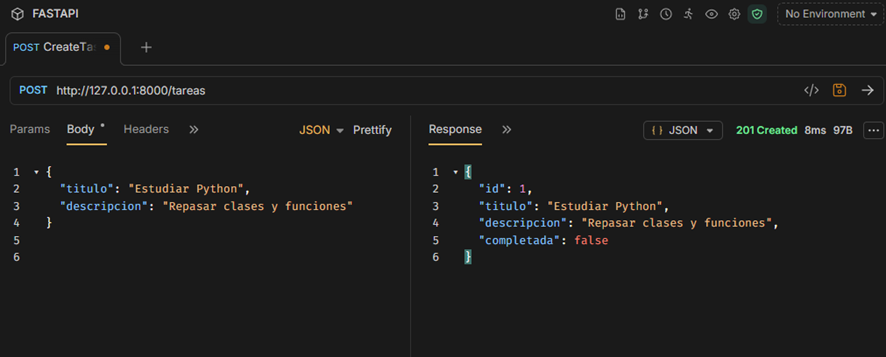
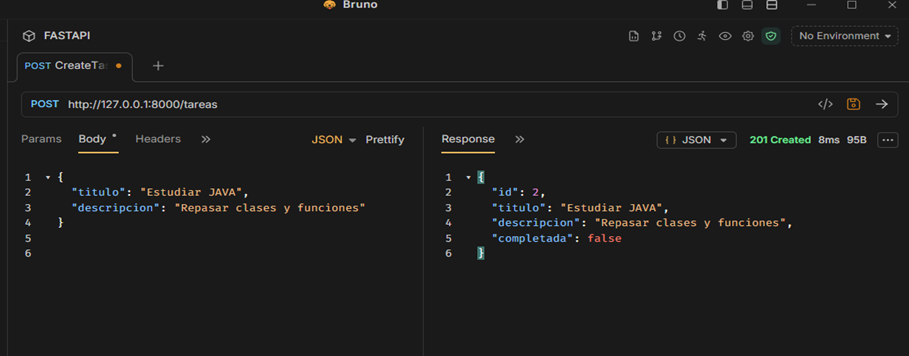

* LISTAR  
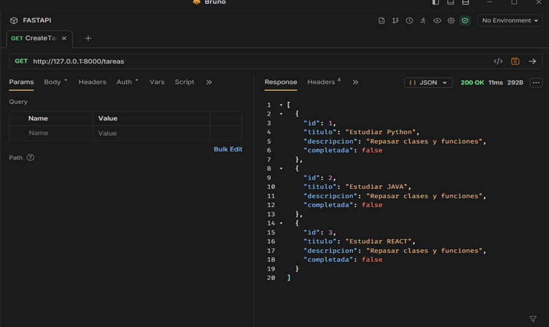
* ACTUALIZAR TAREA  
  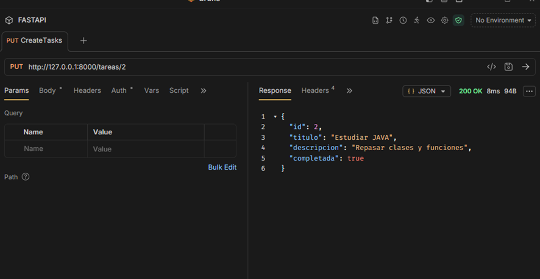
* ELIMINAR TAREA  
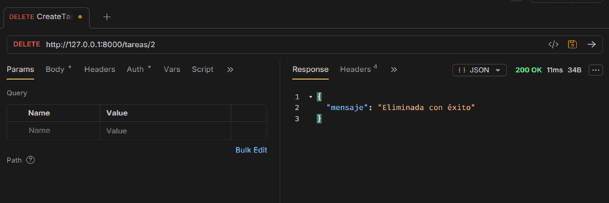
* VERIFICAR  
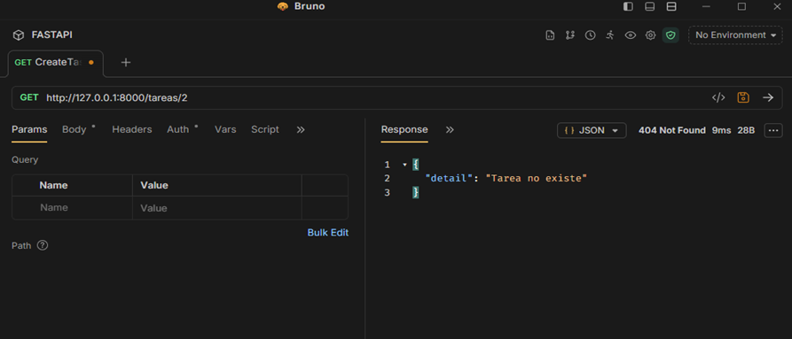

**Declaración de uso de IA:**
* **Qué consulté:** Consulté cómo ejecutar y probar una API construida con FastAPI, ya que el archivo original no iniciaba ningún servidor, y cómo solucionar el error de dependencias faltantes (`Import "uvicorn" could not be resolved`).
* **Qué generó la IA:** La IA generó el bloque de código final (`if __name__ == "__main__":`) implementando `uvicorn.run()` para levantar el servidor local en el puerto 8000. También me proporcionó los comandos de terminal (`pip install fastapi uvicorn`) para instalar las librerías necesarias.
* **Qué modifiqué:** Añadí el bloque de ejecución generado al final de mi archivo `apirest.py`, ejecuté los comandos de instalación en la terminal y verifiqué el entorno de ejecución para que el IDE reconociera las librerías correctamente.
